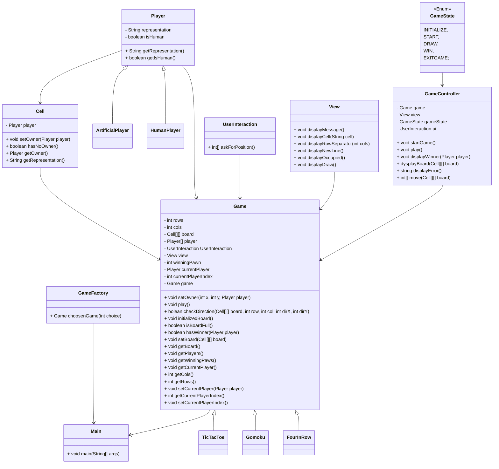

Tic Tac Toe project.

Description :

Creating a Tic Tac Toe game in java that will be run in the console.

Environnement :

- Java Development Kit (JDK): version 17 or higher.
- Gradle: the project is compatible with Gradle 8+ and it is recommended to use the Gradle Wrapper provided (./gradlew).
- Recommended IDE: IntelliJ IDEA (or any other Gradle-compatible Java IDE).
- Internet connection: required to download dependencies from Maven Central (JUnit 5).

Naming :

We use the classical naming rules :
- classes name in PascalCase.
- methods and attributes in camelCase.
- enums in UPPER_CASE.

UML :

